# TP1 - PROJECT : Linear Regression from Scratch


# Dataset Variables

## Features consist of hourly average ambient variables
###  Temperature (AT) in the range 1.81°C and 37.11°C
###  Exhaust Vacuum (V) in teh range 25.36-81.56 cm Hg
###  Ambient Pressure (AP) in the range 992.89-1033.30 milibar
###  Relative Humidity (RH) in the range 25.56% to 100.16%
###  Net hourly electrical energy output (PE) 420.26-495.76 MW. The averages are taken from various sensors located around the plant that record the ambient variables every second. The variables are given without normalization.

## This is a supervised machine learning problem since we have a labelled data set.


---

# Part1 - Linear Regression from Scratch

## Installation of libraries
```Python
import warnings
warnings.filterwarnings('ignore')
import numpy as np
import pandas as pd
from sklearn.linear_model import LinearRegression
import matplotlib.pyplot as plt
import math
```

## Obtention of the excel file
### We have to install xlrd using pip before
```CMD
pip install xlrd
```
### Then we can do this command line
```Python
df = pd.read_excel("D:\efrei\cours\s7\machine learning\lab1\CCPP\Folds5x2_pp.xlsx", sheet_name = None)
df = pd.concat(df, axis = 0, ignore_index = True)
print(df.head())
```
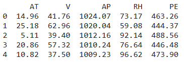


#### In this dataset, we have 4 features (so n = 4) and 47840 observations (so m = 47840)


## We have to normalize our data
```Python
def normalizeFeature(df):
    normalized = (df - df.min()) / (df.max() - df.min())
    df.update(normalized)


normalizeFeature(df)
df.head()
```
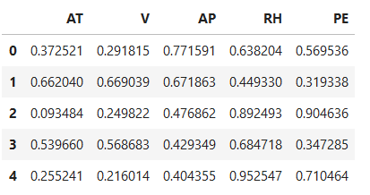


## Now we can extract our values
```Python
x = df[['AT', 'V', 'AP', 'RH']]
y = df[['PE']]

n = len(x.axes[1])
m = len(x.axes[0])

X = np.c_[np.ones((m, 1), dtype = float), x]
print(X)
```
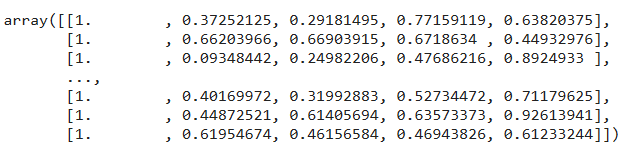


## We have to implement the vector of weights w
### Because we do not have weights yet we instantiate it at 1
```Python
w = np.ones((n + 1, 1))
print(w)
```
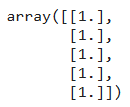


## We have to implement the cost function J
```Python
Cost = []
def costFunction(w, X, y):
    
    hw = np.dot(X, w)
    val = hw - y
    val2 = np.dot(val.transpose(), val)
    
    result = val2 / (2 * m)
    return result[0]

J = costFunction(w, X, y)
Cost.append(costFunction(w, X, y))
print(J)
```
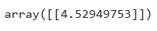


## We have to implement the Gradient Descent
```Python
gradient = np.zeros((n + 1, 1))
def gradientDescent(w, X, y):    

    max_iterations = 100000
    delta = 0.000000000001
    alpha = 0.0001

    for i in range(max_iterations):
        tmp = w
        
        hw = np.dot(X, w)
        val = hw - y
        val2 = np.dot(X.transpose(), val)
        
        w = tmp - val2 * alpha
        
        errN = costFunction(w, X, y)
        errPrev = Cost[-1]
        Cost.append(errN)
        
        if(np.abs(errN - errPrev) < delta):
            print("Done\n", errN, "\n", errPrev)
            break
            
        if(errN > errPrev):
            alpha = alpha / m
            print("alpha reduced : ", alpha)
        
    return w


w = gradientDescent(w, X, y)
print(w)
```
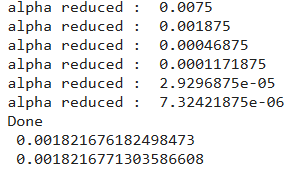
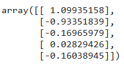


# Part2 - Compare to Scikit-Learn

## Once you build a good model with your from-scratch implementation, build a new model with Scikit-Learn and compare the obtained results.
### Comparaison to the result obtain with Scikit-Learn
```Python
model = LinearRegression()
model.fit(X, y)
model.coef_
model.intercept_
model.coef_[0][0] = model.intercept_

print("theta coef : {0}".format(model.coef_))
print("w           ", w.transpose())
```
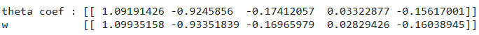


## Add the following functions to your library to calculate R2, MAE, RMSE
### 1. meanAbsoluteError()
```Python
def meanAbsoluteError(predicted, y):
    return ((np.abs(y - predicted)).sum() / len(y))[0]


mae = meanAbsoluteError(np.dot(X, w), y)
print(mae)
```
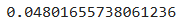

### 2. rootMeanSquaredError()
```Python
def rootMeanSquaredError(predicted, y):
    return (math.sqrt(np.sum((y - predicted) ** 2) / len(y)))


rmse = rootMeanSquaredError(np.dot(X, w), y)
print(rmse)
```
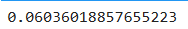

### 3. r2()
```Python
def R2(predicted, y):
    # numerator
    error = (y - predicted) ** 2
    error2 = np.sum(error)[0]
    
    # denomirator
    mean = y.mean()
    variance = (y - mean) ** 2
    variance2 = np.sum(variance)[0]
    
    return (1 - (error2 / variance2))


r2 = R2(np.dot(X, w), y)
print(r2)
```
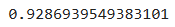


## Use LinearRegression from sklearn.linear_model to build a new linear model
### Compare the obtained R2
```Python
clf = LinearRegression()
clf.fit(np.dot(X, w), y)

print(clf.score(np.dot(X, w), y))
print(r2)
```
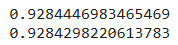


# Part3 - Normal Equation
## Write a function to calculate the optimal values of wi using the normal equation

```Python
def normalEquation(X, y):
    return np.dot(np.linalg.inv(np.dot(X.transpose(), X)), np.dot(X.transpose(), y))

normalEq = normalEquation(X, y)
print(normalEq)
```
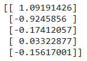


## Compare w from the normal equation and from the gradient
```Python
print("w       ", w.transpose())
print("normalEq", normalEq.transpose())
```
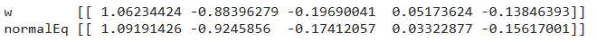
